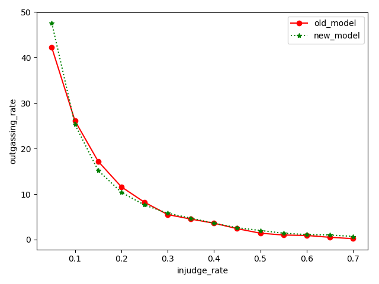

###model path
+ **old model**: /home/changqing/workspace/Overseas_review-master/model/unpron_cla_4_epoch_28_acc_0.9309_auc_0.9910.pth  
+ **new model**: /home/changqing/workspaces/Overseas_classification-master/EfficientNet_Simple/model/unpron/unpron_cla_4_epoch_28_acc_0.9309_auc_0.9910.pth

### data path
- **cocofun_normal**: /data1/zhaoshiyu/cocofun_normal
- **cocofun_unnorm**: /data/wangruihao/serious_data/kill_image
###logits path
> cocofun_normal
> > * for old model: /summary/logits/cocofun_normal/best_accuracy_4_class_b4_accuracy_adl_0_380.pth_logits.txt
> > * for new model: /summary/logits/cocofun_normal/unpron_cla_4_epoch_28_acc_0.9309_auc_0.9910.pth_logits.txt

> cocofun_unnorm
> > * for old model: /summary/logits/cocofun_unnorm/best_accuracy_4_class_b4_accuracy_adl_0_380.pth_logits.txt
> > * for new model: /summary/logits/cocofun_unnorm/unpron_cla_4_epoch_28_acc_0.9309_auc_0.9910.pth_logits.txt

***

***
###result (two treshold:0.3 and 0.5)
>###############################cocofun normal############################
>####old:
> > + total imgs : 71565, error imgs : 15805, img acc : *0.7791518200237546*
> > + total invs : 4998,  error invs : 2430,  inv acc : *0.5138055222088835*
>
>####new:
> > + total imgs : 71565, error imgs : 20523, img acc : *0.7132257388388179*
> > + total invs : 4998,  error invs : 1989,  inv acc : *0.6020408163265306*

>###############################skill images##############################
>####old:
> > + total imgs : 46604, error imgs : 23775, img acc : *0.48985065659600036*
> > + total invs : 3184,  error invs : 488,   inv acc : *0.8467336683417085*
>####new:
> > + total imgs : 46604, error imgs : 26239, img acc : *0.43697965839842073*
> > + total invs : 3184,  error invs : 410,   inv acc : *0.8712311557788944*

###result (one treshold )
#################################cocofun_norm####################################
####old (image mode...):
+ under threshold 0.5, recall: 0.8155103751833997
+ under threshold 0.6, recall: 0.799986026689024
+ under threshold 0.7, recall: 0.782044295395794
+ under threshold 0.8, recall: 0.7607769160902675
+ under threshold 0.9, recall: 0.7248096136379515
>####new:
+ under threshold 0.5, image recall: 0.8284496611472089--59288/71565
+ under threshold 0.6, image recall: 0.7802976315237896--55842/71565
+ under threshold 0.7, image recall: 0.7164954936072102--51276/71565
+ under threshold 0.8, image recall: 0.620708446866485--44421/71565
+ under threshold 0.9, image recall: 0.40732201495144277--29150/71565

####old (invitation mode...):
+ under threshold 0.5, invitation recall: 0.5313960577118472
+ under threshold 0.6, invitation recall: 0.5057915057915058
+ under threshold 0.7, invitation recall: 0.4781548465758992
+ under threshold 0.8, invitation recall: 0.44767323714692137
+ under threshold 0.9, invitation recall: 0.40377971956919323

>####new:
+ under threshold 0.5, invitation recall: 0.5602519813046128
+ under threshold 0.6, invitation recall: 0.47754521438731967
+ under threshold 0.7, invitation recall: 0.3885389148547043
+ under threshold 0.8, invitation recall: 0.28591749644381226
+ under threshold 0.9, invitation recall: 0.15383052225157487

###############################cocofun_unnorm##########################
####old (image mode...):
+ injudge: 0.05 threshold 2.361095539527014e-05, invitation outgassing rate recall: 0.4225103123158515--717/1697
+ injudge: 0.1 threshold 0.0003747180162463337, invitation outgassing rate recall: 0.26163818503241015--444/1697
+ injudge: 0.15 threshold 0.002645500237122178, invitation outgassing rate recall: 0.17265763111373011--293/1697
+ injudge: 0.2 threshold 0.012226594612002373, invitation outgassing rate recall: 0.11608721272834413--197/1697
+ injudge: 0.25 threshold 0.039714712649583817, invitation outgassing rate recall: 0.08249852681202122--140/1697
+ injudge: 0.3 threshold 0.1024278774857521, invitation outgassing rate recall: 0.0553918680023571--94/1697
+ injudge: 0.35 threshold 0.16242332756519318, invitation outgassing rate recall: 0.04596346493812611--78/1697
+ injudge: 0.4 threshold 0.26573309302330017, invitation outgassing rate recall: 0.03653506187389511--62/1697
+ injudge: 0.45 threshold 0.4098036289215088, invitation outgassing rate recall: 0.024160282852091926--41/1697
+ injudge: 0.5 threshold 0.6236545443534851, invitation outgassing rate recall: 0.014142604596346494--24/1697
+ injudge: 0.55 threshold 0.7938115000724792, invitation outgassing rate recall: 0.010017678255745434--17/1697
+ injudge: 0.6 threshold 0.9046652317047119, invitation outgassing rate recall: 0.009428403064230996--16/1697
+ injudge: 0.65 threshold 0.9598418474197388, invitation outgassing rate recall: 0.005303476723629935--9/1697
+ injudge: 0.7 threshold 0.9856488704681396, invitation outgassing rate recall: 0.002357100766057749--4/1697
+ injudge: 0.75 threshold 0.9958676099777222, invitation outgassing rate recall: 0.0011785503830288745--2/1697
+ injudge: 0.8 threshold 0.9989489912986755, invitation outgassing rate recall: 0.0011785503830288745--2/1697
+ injudge: 0.85 threshold 0.9998018145561218, invitation outgassing rate recall: 0.0005892751915144372--1/1697
+ injudge: 0.9 threshold 0.9999810457229614, invitation outgassing rate recall: 0.0--0/1697
+ injudge: 0.95 threshold 0.9999996423721313, invitation outgassing rate recall: 0.0--0/1697

>####new:
+ injudge: 0.05 threshold 0.01870303973555565, invitation outgassing rate recall: 0.4761343547436653--808/1697
+ injudge: 0.1 threshold 0.05091641843318939, invitation outgassing rate recall: 0.253388332351208--430/1697
+ injudge: 0.15 threshold 0.11276190727949142, invitation outgassing rate recall: 0.15203299941072482--258/1697
+ injudge: 0.2 threshold 0.18457616865634918, invitation outgassing rate recall: 0.10430170889805539--177/1697
+ injudge: 0.25 threshold 0.26059725880622864, invitation outgassing rate recall: 0.07660577489687684--130/1697
+ injudge: 0.3 threshold 0.330279678106308, invitation outgassing rate recall: 0.05892751915144372--100/1697
+ injudge: 0.35 threshold 0.3981361389160156, invitation outgassing rate recall: 0.04714201532115498--80/1697
+ injudge: 0.4 threshold 0.45077529549598694, invitation outgassing rate recall: 0.03653506187389511--62/1697
+ injudge: 0.45 threshold 0.5128401517868042, invitation outgassing rate recall: 0.026517383618149676--45/1697
+ injudge: 0.5 threshold 0.5733217597007751, invitation outgassing rate recall: 0.020035356511490868--34/1697
+ injudge: 0.55 threshold 0.63186115026474, invitation outgassing rate recall: 0.01473187978786093--25/1697
+ injudge: 0.6 threshold 0.6890443563461304, invitation outgassing rate recall: 0.011196228638774307--19/1697
+ injudge: 0.65 threshold 0.7408294081687927, invitation outgassing rate recall: 0.01060695344725987--18/1697
+ injudge: 0.7 threshold 0.7873456478118896, invitation outgassing rate recall: 0.007071302298173247--12/1697
+ injudge: 0.75 threshold 0.8313784599304199, invitation outgassing rate recall: 0.00648202710665881--11/1697
+ injudge: 0.8 threshold 0.869635283946991, invitation outgassing rate recall: 0.0041249263406010605--7/1697
+ injudge: 0.85 threshold 0.902525782585144, invitation outgassing rate recall: 0.002357100766057749--4/1697
+ injudge: 0.9 threshold 0.9359068274497986, invitation outgassing rate recall: 0.0005892751915144372--1/1697
+ injudge: 0.95 threshold 0.9652119874954224, invitation outgassing rate recall: 0.0--0/1697

compare:

image mode...
old
under threshold 0.5, image false recall: 0.5283452064200498--24623/46604
under threshold 0.6, image false recall: 0.5103424598746888--23784/46604
under threshold 0.7, image false recall: 0.48985065659600036--22829/46604
under threshold 0.8, image false recall: 0.46564672560295256--21701/46604
under threshold 0.9, image false recall: 0.42899751094326666--19993/46604

new
under threshold 0.5, image false recall: 0.5467771006780534--25482/46604
under threshold 0.6, image false recall: 0.4957728950304695--23105/46604
under threshold 0.7, image false recall: 0.43697965839842073--20365/46604
under threshold 0.8, image false recall: 0.3544974680284954--16521/46604
under threshold 0.9, image false recall: 0.21360827396789975--9955/46604

invitation mode...
old
under threshold 0.5, invitation false recall: 0.1876178504085481--597/3182
under threshold 0.6, invitation false recall: 0.16907605279698304--538/3182
under threshold 0.7, invitation false recall: 0.15273412947831552--486/3182
under threshold 0.8, invitation false recall: 0.13827781269641734--440/3182
under threshold 0.9, invitation false recall: 0.11627906976744186--370/3182

new
under threshold 0.5, invitation false recall: 0.2338152105593966--744/3182
under threshold 0.6, invitation false recall: 0.18824638592080453--599/3182
under threshold 0.7, invitation false recall: 0.12822124450031427--408/3182
under threshold 0.8, invitation false recall: 0.07291011942174733--232/3182
under threshold 0.9, invitation false recall: 0.021684475172847266--69/3182

under threshold 0.5337, invitation false recall: 0.21653048397234445--689/3182
under threshold 0.5655, invitation false recall: 0.20081709616593338--639/3182
under threshold 0.5984, invitation false recall: 0.18856065367693275--600/3182
under threshold 0.6334, invitation false recall: 0.1715901948460088--546/3182
under threshold 0.6844, invitation false recall: 0.13733500942803267--437/3182